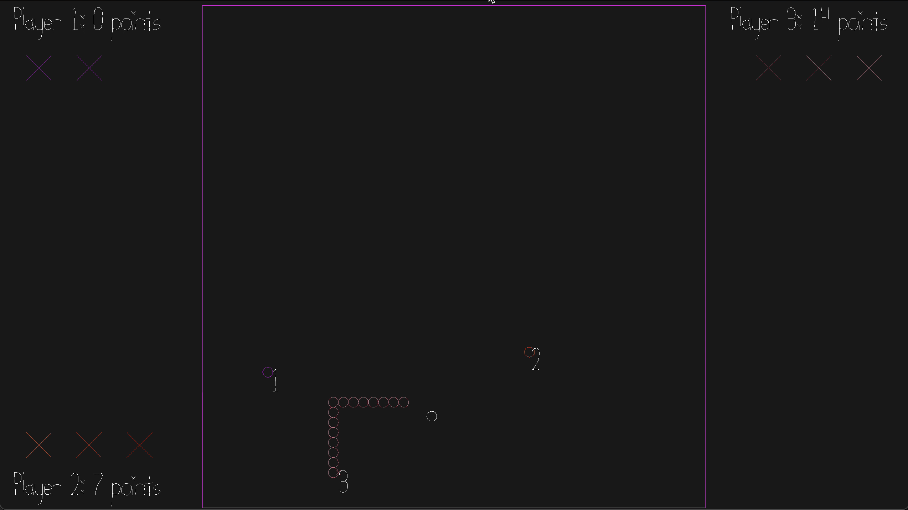

# snakey snakes

Author: Kavya Tummalapalli

Design: What is new and interesting about my game is that this is a multiplayer snake game where the snakes are competing for food and can "attack" (cut each other off) to try to become the longest snake!

Networking: My game implements client/server multiplayer by sending messages with player information to the server and receiving information back and similarly the server sending controls messages to the client and the clients using this information to update the player and game states. Most of the messages code is located in Game.cpp in the send_controls_message(), recv_controls_message(), send_state_message(), and recv_state_message() functions.

Screen Shot:

How To Play:

The controls of this game are to use the wasd keys for up, left, down, and right respectively to move your snake. Collect the food (the white circles) to grow your snake, and avoid running into or through other snakes as they can cut you off and you can lose your 3 lives. Try to grow to be the longest snake possible, while attempting to stay alive!

This game was built with [NEST](NEST.md).

